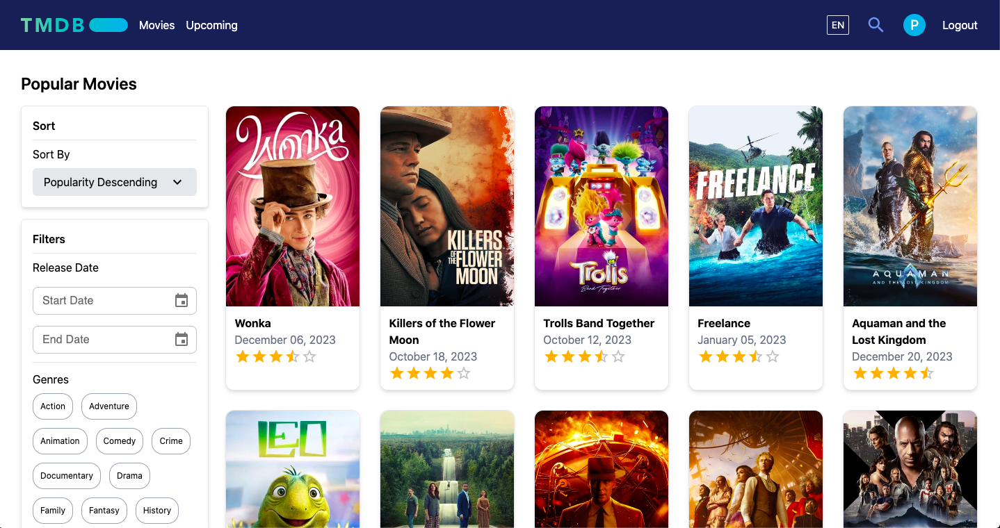
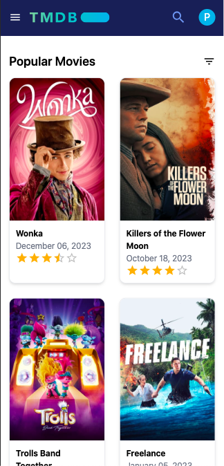

# Movie Tracker App :movie_camera:

Welcome to the React Movie Tracker App! This application allows users to track and manage their favorite movies, explore movie details, search for movies, and much more.

## Preview
### Desktop view

### Mobile view

## Features 🚀

### 1. Overview Page

- Filters and sorting options for movie lists.
- Genre selection for customized movie exploration.
- Infinite loading as users scroll through movie lists.

### 2. Movie Details Page

- Users can add movies to favorites, watch list, or rate them (requires login).
- Access to movie reviews, cast, and related information.
- Display of movie-related details.

### 3. Search

- Users can search for movies.

### 4. Upcoming Movies

- A dedicated page displaying upcoming movies.
- Infinite loading for user convenience.

### 5. User Authentication

- Users can log in.
- Manage favorite movies, watch later lists, and rate movies.
- Remove movie ratings.

## Technologies Used

- ReactJS with TypeScript: Building the user interface.
- React Query: Handling data fetching and state management.
- React Router: Managing navigation between pages.
- Tailwind CSS: Styling the app for a modern look.
- Zustand: State management.
- Axios: Making API requests.
- Material UI: UI components.
- Headless UI: UI elements.
- Luxon: Date formatting.
- Formik with Yup: Form handling & validation
- React i18next: For handling translation

## Getting Started

This app was bootstrapped using Vite. Follow the steps below to run the app locally:

1. Clone the repository.
2. Install dependencies using `npm install`.
3. Start the development server using `npm run dev`.
4. The App should be live at `port:5173`
